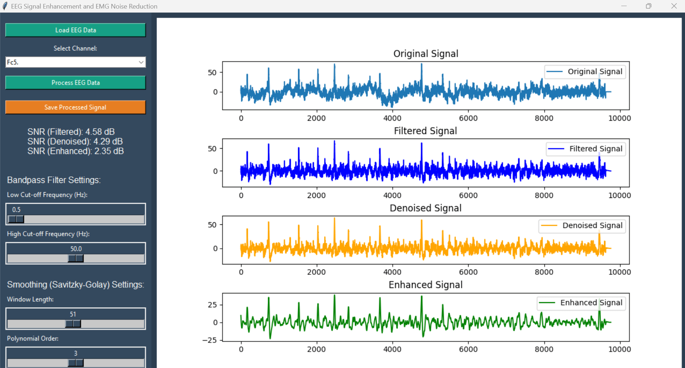

# EEG Signal Enhancement & EMG Noise Reduction

## Project Overview
This project focuses on enhancing EEG signals and reducing EMG noise using various signal processing techniques. The application provides a graphical user interface (GUI) for loading EEG data, processing it, and visualizing the results. The processing steps include bandpass filtering, wavelet-based denoising, and signal smoothing using the Savitzky-Golay filter.

## Features
- **Load EEG Data**: Load EEG data from `.edf` files.
- **Channel Selection**: Select specific EEG channels for processing.
- **Bandpass Filtering**: Apply a bandpass filter to remove unwanted frequency components.
- **EMG Noise Reduction**: Use wavelet transforms to reduce EMG noise.
- **Signal Enhancement**: Smooth the signal using the Savitzky-Golay filter.
- **SNR Calculation**: Calculate and display the Signal-to-Noise Ratio (SNR) for each processing step.
- **Save Processed Data**: Save the enhanced signal as a `.npy` file.

## Requirements
- Python 3.x
- Libraries: `numpy`, `scipy`, `pywt`, `pyedflib`, `matplotlib`, `tkinter`

## Installation
1. Clone the repository:
   ```bash
   git clone https://github.com/yourusername/eeg-signal-enhancement.git
   ```
2. Navigate to the project directory:
   ```bash
   cd eeg-signal-enhancement
   ```
3. Install the required libraries:
   ```bash
   pip install -r requirements.txt
   ```

## Usage
1. Run the script:
   ```bash
   python eeg_signal_enhancement.py
   ```
2. Use the GUI to:
   - Load an EEG data file (`.edf` format).
   - Select a channel for processing.
   - Adjust the bandpass filter and smoothing settings.
   - Process the data and view the results.
   - Save the processed signal.

## Screenshots
 
*Place your output screenshot in the `screenshots` folder and update the path above.*

## Contributors
- Bilal Qadeer (22-CP-30)
- Habib Khan (22-CP-62)
- Rehan Umar (22-CP-72)

## License
This project is licensed under the MIT License. See the [LICENSE](LICENSE) file for details.

## Acknowledgments
- Special thanks to the authors of the libraries used in this project.
- Inspired by various DSP techniques and research papers on EEG signal processing.

---

Feel free to customize this README further to better fit your project's specifics. Make sure to replace placeholders like `yourusername` with your actual GitHub username and update the screenshot path as needed.